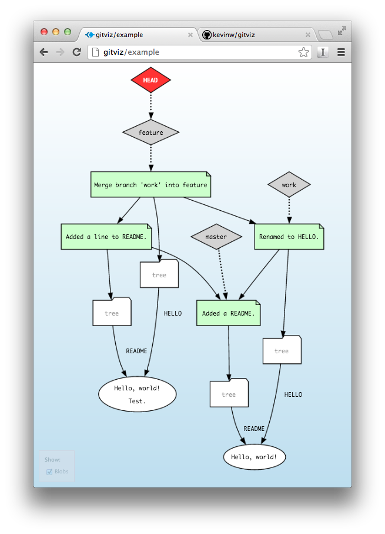

% Slide Header
% how to make slide's html
% slideshow -t s5themes -o path/to/slide/ githosting.md

theme: i18n  
author: @ryosms  
company:  
title: Gitホスティング総選挙  
subtitle: 2013/12/14 合同勉強会 in 大都会岡山 -2013 Winter-  
footer: 2013/12/14  
subfooter: at gbdaitokai(合同勉強会 in 大都会岡山)  

% Slide Header End

# 自己紹介

[@ryosms](https://twitter.com/ryosms)

* 岡山Gitユーザー会(okagit)
* \#パソコン交流会
* \#パソコン直流会

# お断り

* ここで紹介するのは個人的に観測したものです  
* まだ使えるレベルに達していないものもあるかもしれません
* 既に開発が止まってるものもあるかもしれません
* ただの紹介です。どれを使うかは各自で判断してください
* 時間の都合で最期まで紹介できないかもしれません

# お品書き

* ホスティングサービス
* ホスティングサーバー
* その他

# ホスティングサービス

* GitHub - <https://github.com>
* bitbucket - <https://bitbucket.org/>
* Gitorious - <http://gitorious.org>
* Assembla - <https://www.assembla.com/>
* Google Code - <https://code.google.com/>
* SourceForge.JP - <http://sourceforge.jp/>

# ホスティングサーバー

* GitLab - <http://gitlab.org/>
* gitolite - <http://gitolite.com/>
* ALMinium - <http://alminium.github.io/alminium/>
* Gitblit - <http://gitblit.com/>
* GitBucket - <https://github.com/takezoe/gitbucket>
* GitPrep - <https://github.com/yuki-kimoto/gitprep>

# その他

Viewerやその他おもしろツール

* gisthub (gist clone) - <https://github.com/seratch/gistub>
* gollum (wiki) - <https://github.com/gollum/gollum>
* gitiles (Viewer) - <https://code.google.com/p/gitiles>
* GitList (Viewer) - <https://github.com/klaussilveira/gitlist>
* gitviz (Viewer) - <https://github.com/kevinw/gitviz>
* RestfulGit (Restful API) - <https://github.com/hulu/restfulgit>ß

# GitHub

* <https://github.com>
* みんな大好きGitHub  
* プライベートリポジトリは課金兵のみ  
* ホスティングサーバー : [GitHub Enterprice](https://enterprise.github.com)  

# bitbucket

* <https://bitbucket.org/>  
* hgも使える(むしろそっちが先)  
* Pythonistaが多い感じ(hgで)  
* 無料でもプライベートリポジトリを使える  
* ホスティングサーバー： [Stash](https://www.atlassian.com/ja/software/stash/overview)  

# Gitorious

* <http://gitorious.org/>  
* GitHubクローン
* ただし、最近のGitHubのUIとは違う感じ
* Qtなんかが使ってる
* ホスティングサーバー： [Gitorious](https://gitorious.org/gitorious/)

# Assembla

* <https://www.assembla.com/>
* 独自のUI
* 無料でプライベートリポジトリを1つ作れる
* かつて瀬戸デ部で使おうとしたことがある
* svnのホスティングも可能(そっちがメイン？)

# Google Code

* <https://code.google.com/>
* Google製のホスティングサービス
* ライセンスに縛りあり(Open Source Initiative指定)
* svn、hgも使用可能

# SourceForge.JP

* <http://sourceforge.jp>
* [SourceForge.net](http://sourceforge.net) の姉妹サイト
* オープンソースなプロジェクトのみ
* FFFTPとか
* svn、hgも使用可能

# GitLab

* <http://gitlab.org/>
* 貧者のGitHub Enterprise  
	(この呼称はどうかと思うけど)
* アップデートが頻繁(月1回 22日前後)
* クラウド版(サービス)：[GitLab Cloud](https://gitlab.com/users/sign_in)
* CIサーバーもある -> [GitLab CI](http://gitlab.org/gitlab-ci/)

# gitolite

* <http://gitolite.com/>
* サーバー機能のみ
* 昔はGitLabがバックエンドに使用
* ブラウザで見る必要がない場合はこれでおｋ

# ALMinium

* <http://alminium.github.io/alminium/>
* ホスティング + Redmine + α
* コマンド一発でセットアップが完了
* 昔使った時はgitがhttp(s)アクセスしかできなかったけど最近はどうなんだろ？
* svn、hgも使用可能

# Gitblit

* <http://gitblit.com/>
* Java製(Javaさえ動けば使える)
* Tomcat同梱版も用意されてる
* なんとなく日本語化もされてるような気がする

# Gitbucket

* <https://github.com/takezoe/gitbucket>
* Scala製
* 使ってないのでよくわかりません

# GitPrep

* <https://github.com/yuki-kimoto/gitprep>
* PHP製
* 使ってないのでよくわかりません

# Gistub

* <https://github.com/seratch/gistub>
* Gist Clone

# gollum

* <https://github.com/gollum/gollum>
* wiki エンジン
* GitLabのインストールログを眺めてるとこれが使われてるっぽい

# gitiles

* <https://code.google.com/p/gitiles>
* リポジトリViewer
* AndroidのリポジトリViewerとして使われてる  
	<https://android.googlesource.com/>

# GitList

* <https://github.com/klaussilveira/gitlist>
* リポジトリViewer
* GitHubっぽいUI

# gitviz

* <https://github.com/kevinw/gitviz>
* リポジトリViwer
* 面白い見た目

# RestfulGit

* <https://github.com/hulu/restfulgit>
* Restful API
* リポジトリの内容をJSONとして出力

# おしまい

ご静聴ありがとうございました

