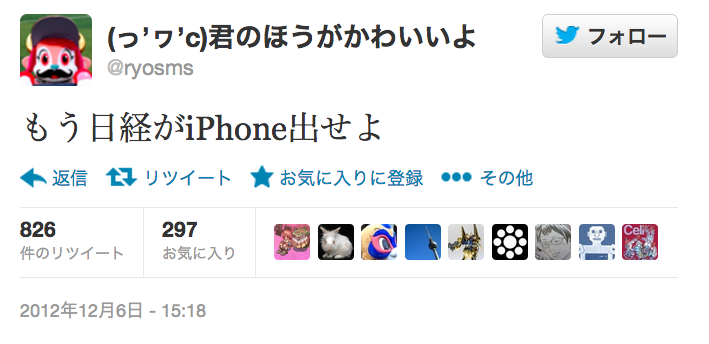
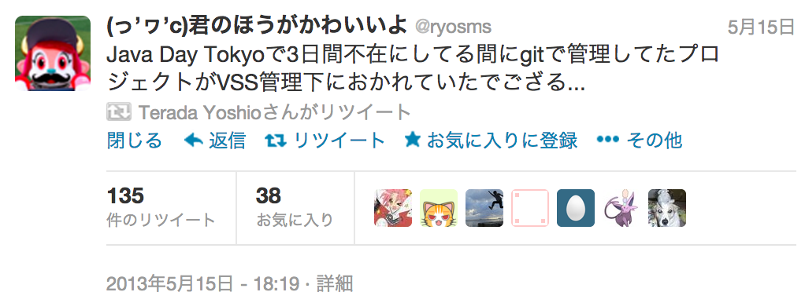
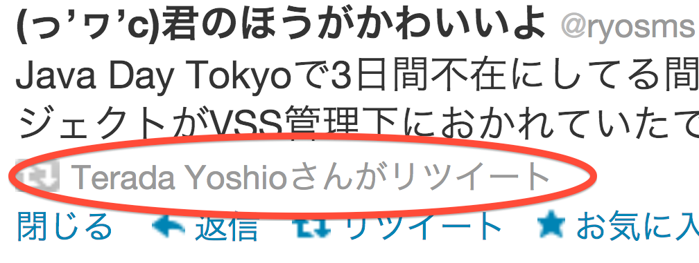

% Slide Header
% how to make slide's html
% slideshow -t s5themes -o path/to/slide/ JavaDayTokyo.md

theme: i18n  
author: @ryosms  
company:  
title: Java Day Tokyo 2013に参加して  
subtitle: 2013/06/15 岡山Java User Group  
footer: 2013/06/15  
subfooter: at okajug(Okayama Java User Group)  

% Slide Header End

# 自己紹介

## ryosms

twitter: [@ryosms](https://twitter.com/ryosms)  
github: [ryosms](https://github.com/ryosms)

### ・岡山Javaユーザ会 相談役

### ・パソコン交流会(岡山Gitユーザ会)

### ・日本AのつくJavaのようなものの会岡山支部

### etc…

# 自己紹介

最近はベストツイートで自己紹介するのがトレンドと聞いて

# 本日のお品書き

- 前日（移動日）
- Java Day Tokyo当日
- 翌日（会社訪問Day）
- まとめ

# Java Day Tokyo前日

- よみがえる[前年の悪夢](http://blog.livedoor.jp/ryosms/archives/6069917.html)

# Java Day Tokyo前日

- よみがえる[前年の悪夢](http://blog.livedoor.jp/ryosms/archives/6069917.html)
- 結局なんの波乱もなく到着

# Java Day Tokyo前日

- よみがえる[前年の悪夢](http://blog.livedoor.jp/ryosms/archives/6069917.html)
- 結局なんの波乱もなく到着
- 夜は首都圏のAndroiderたちと酒盛り

# Java Day Tokyo前日

- よみがえる[前年の悪夢](http://blog.livedoor.jp/ryosms/archives/6069917.html)
- 結局なんの波乱もなく到着
- 夜は首都圏のAndroiderたちと酒盛り
- 得たもの = [Ingress](http://www.ingress.com/)

# Ingress #とは

- Googleの運営するARゲーム
- 陣取りゲーム
- 緑と青の2勢力

# Ingress #とは

- Googleの運営するARゲーム
- 陣取りゲーム
- 緑と青の2勢力
- Java Day Tokyo 2013との関係？

# Ingress #とは

- Googleの運営するARゲーム
- 陣取りゲーム
- 緑と青の2勢力
- Java Day Tokyo 2013との関係？
	* ありません
	* 強いて言えばAのつくアレなのでJavaのようなもので(ry	

# Java Day Tokyo 2013当日

TODO: 書く

# Java Day Tokyo翌日

- 恒例のokajugメンバーによる会社訪問
	* 昨年はTwitter Japanにお邪魔しました
- 今年訪問した会社

# Java Day Tokyo翌日

- 恒例のokajugメンバーによる会社訪問
	* 昨年はTwitter Japanにお邪魔しました
- 今年訪問した会社
	* サムライズム（昨年に引き続きTwitter4Jのイケメンのお世話に）  
		無限`Red Bull`

# Java Day Tokyo翌日

- 恒例のokajugメンバーによる会社訪問
	* 昨年はTwitter Japanにお邪魔しました
- 今年訪問した会社
	* サムライズム（昨年に引き続きTwitter4Jのイケメンのお世話に）  
		無限`Red Bull`
	* ウサギィ（オープンセミナーの時に実行委員権限を濫用しました←）  
		ご存知`海鮮丼`

# まとめ

## 公式のイベントに出席することの意味

- `公式`というのはやはり強い
- `中の人`の話を直接聞ける / 質問できる
- 場合によってはセッション外で直に話をする機会も

# まとめ

## 遠征することの意味

- 他の地域の(勉強会等の)事情を知ることができる
	* 岡山とどのように運営が違うのか
	* 参加者の感じなど
- 交流が広がる
	* SNSではよく絡んでるけど… → 会える(かもしれない)

# まとめ

- 公式のイベントでしか得られないものもある

# まとめ

- 公式のイベントでしか得られないものもある
- 他地域に遠征することで見えてくるものもある

# まとめ

- 公式のイベントでしか得られないものもある
- 他地域に遠征することで見えてくるものもある
- Ingressやろうぜ、Ingress

# おまけ

- Java Day Tokyo終了後

# ？！

- アイエエエエ！ テラダヨシオ!? テラダヨシオナンデ!?

# ご静聴ありがとうございました

