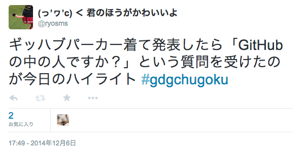
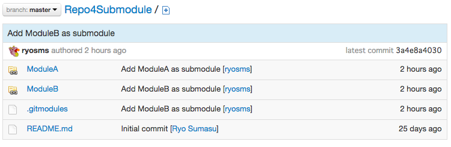
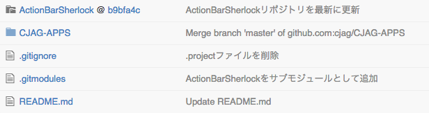
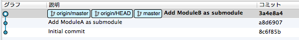
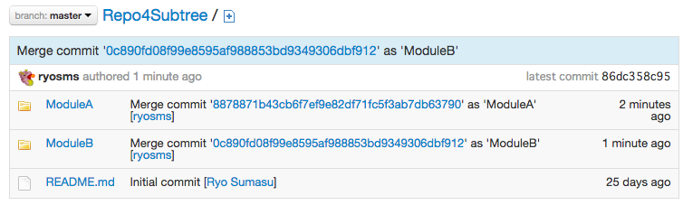
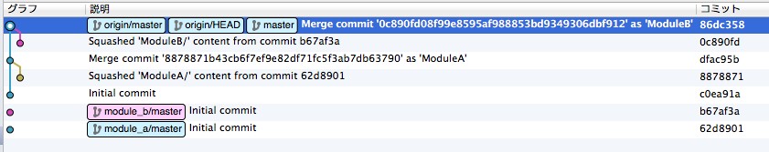
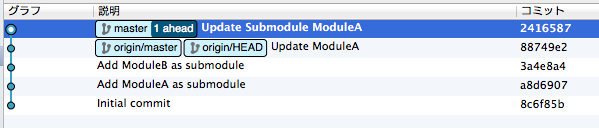
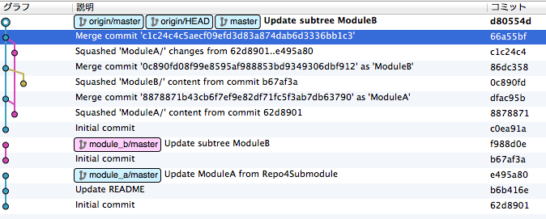

% Slide Header
% how to make slide's html
% slideshow -t s5themes -o path/to/slide/ git_sub_module_tree.md

theme: i18n  
author: @ryosms  
company:  
title: git subtreeとかgit submoduleとか  
subtitle: 2014/12/13 合同勉強会 in 大都会岡山 -2014 Winter-  
footer: 2014/12/13  
subfooter: at gbdaitokai(合同勉強会 in 大都会岡山)  

% Slide Header End

# 自己紹介

[@ryosms](https://twitter.com/ryosms)

* 岡山Gitユーザー会(okagit)
* \#パソコン交流会
* \#パソコン直流会
* 工事のおじさん

# 自己紹介

# 内容

* リポジトリ構成
* 初期化
* 更新の取り込み
* 更新の反映
* クローン
* 削除
* まとめ

# リポジトリ構成

* 以下の構成で検証しました

	- ModuleA
	- ModuleB
	- Repo4Submodule
		+ ModuleA : ModuleAをSubmoduleとして取り込み
		+ ModuleB : ModuleBを〃
	- Repo4Subtree
		+ ModuleA : ModuleAをSubtree mergeで取り込み
		+ ModuleB : ModuleBを〃

# 初期化 - Git Submodule

* 以下のコマンドを実行

	$ git submodule add path/to/ModuleA.git ModuleA  
	$ git add .  
	$ git commit -m "Add ModuleA as submodule"

	- Submodule追加後にコミットが必要

* ModuleBについても同様にして初期化する

# 初期化 - Git Submodule

* 初期化直後のリポジトリ状態
	- gitbucketにpushして確認(以下同様)

# 初期化 - Git Submodule

* ちなみにSubmoduleなリポジトリをGitHubで見ると

cjag / CJAG-APPS - [https://github.com/cjag/CJAG-APPS](https://github.com/cjag/CJAG-APPS)

# 初期化 - Git Submodule

* 初期化直後のコミットグラフ
	- SourceTreeにて確認(以下同様)

# 初期化 - Git Subtree

* 以下のコマンドを実行

	$ git remote add -f module_a path/to/ModuleA.git  
	$ git subtree add --prefix=ModuleA/ --squash module_a master

	- subtree addの時点で自動的にコミットされる

* ModuleBについても同様にして初期化する

# 初期化 - Git Subtree

* 初期化直後のリポジトリ状態

# 初期化 - Git Subtree

* 初期化直後のコミットグラフ

# 更新の取り込み - 準備

* ModuleAの内容を直接更新

	$ git add.  
	$ git commit -m "Update README"  
	$ git push origin master

# 更新の取り込み - Git Submodule

* 一度Submoduleのディレクトリに入ってpullする

	$ cd ModuleA  
	$ git pull origin master

* Submoduleから出てcommit

	$ cd ../  
	$ git commit -am "Update ModuleA"

# 更新の取り込み - Git Submodule

* もしくは、git submodule foreachを使う

	$ git submodule foreach git pull  
	$ git commit -am "Update ModuleA"

* 複数のSubmoduleを一括更新する場合に便利

# 更新の取り込み - Git Subtree

* git subtree pullを使う

	$ git subtree pull --prefix=ModuleA/ --squash module_a master

 	※ --squashで初期化した場合はpullで--squash付けないとconflictするから注意

# 更新の反映 - Git Submodule

* ModuleAを変更後、ModuleAのディレクトリに入ってcommit→pushする

	$ cd ModuleA  
	$ git commit -am "Update ModuleA from Repo4Submodule"  
	$ git push origin master  

* Submoduleから出てcommit→push

	$ cd ../  
	$ git commit -am "Update Submodule ModuleA"  
	$ git push origin master  

# 更新の反映 - Git Subtree

* ModuleBを更新後、普通にcommit→pushする

	$ git commit -am "Update subtree ModuleB"

* git subtree pushでModuleBのリポジトリにpushする

	$ git subtree push --prefix=ModuleB/ module_b master

# Commit Graph - Git Submodule

* ここまでの操作のCommit Graphを確認

# Commit Graph - Git Subtree

###### Submoduleに比べたらゴチャゴチャしてる...

# クローン - Git Submodule

* 普通にCloneした後でsubmoduleコマンドで初期化する

	$ git clone path/to/Repo4Submodule.git  
	$ git submodule init  
	$ git submodule update

* Clone時にSubmoduleも同時に初期化するには--recursive

	$ git clone --recursive path/to/Repo4Submodule.git

# クローン - Git Submodule

* Clone直後はSubmoduleのbranchに注意する

	$ cd ModuleA  
	$ git branch  
	　\* (detached from \<commit hash\>)  
	　　master

* 全submoduleのbranchをmasterにするには

	$ git submodule foreach git checkout master

	※ master != push時のsubmodule

# クローン - Git Subtree

* Clone後にSubtreeのリポジトリを追加する

	$ git clone path/to/Repo4Subtree.git  
	$ git remote add -f module_a path/to/ModuleA.git  
	$ git remote add -f module_b path/to/ModuleB.git

	※ ModuleA、ModuleBを修正しない(書き戻さない)ならクローンしただけでもOK

# 削除 - Git Submodule

* Submoduleをリポジトリから削除する場合はgit submodule deinitを使う

	$ git submodule deinit ModuleA  
	$ git rm ModuleA  
	$ git commit -am "Delete submodule, ModuleA"  
	$ rm -rf .git/modules/ModuleA

	- deinitでModuleAディレクトリの中身を(.gitディレクトリごと)空にする
	- その後のgit rmで実際にSubmoduleが削除される
	- 最後に.gitの中に残っているゴミを削除する

# 削除 - Git Subtree

* Subtreeは通常のディレクトリと同じなのでgit rmで消す

	$ git rm ModuleA  
	$ commit -am "Delete subtree, ModuleA"  
	$ git remote rm module_a

# まとめ

* 使い分け
	- 他人のリポジトリはSubmodule
	- 自分のリポジトリはSubtree
	- ... と言われてる

* 他にも
	- 別々に育ててるリポジトリ間でバージョンを揃えたい場合はSubmodule  
		ex: 昔のFuelPHP方式
	- 外部のリポジトリを同時に育てる場合はSubtree  

# おしまい

ご静聴ありがとうございました

